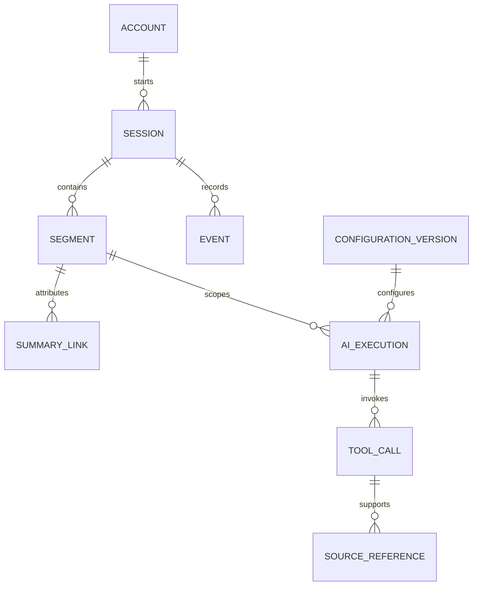

# Architecture and collection rules

Status: proposed design, October 6, 2026. See the [dictionary](DATA_DICTIONARY.md) for current versus proposed records and the [backlog](IMPLEMENTATION_BACKLOG.md) for implementation order.

## Three data boundaries

| Boundary | Contents | Access |
| --- | --- | --- |
| Product operations | Accounts, family/student scopes, summaries, plans, sessions and minimal reliability events | Verified account permissions; narrowly authorized operational support |
| Model evaluation | Synthetic cases, configuration/source versions, evaluation results; permitted redacted examples only when separately approved | Evaluation service and designated reviewers |
| Research | Study enrollments, permission evidence, pseudonymous measurements and versioned exports | Study-specific approved service/researcher access, never ordinary institution membership |

Schemas alone do not enforce separation. Use database roles/grants, server authorization, restricted views and reviewed export paths. Keep the identity-to-study mapping separately restricted. Begin in PostgreSQL; introduce a warehouse or materialized views only after query load and reporting requirements justify them.

## Identity and ownership

- Resolve account identity from a verified JWT. Never accept a client-supplied account ID as authorization. Email is a contact attribute, not a durable identity or automatic account-merging key.
- Current `auth0_subject` uniqueness assumes one issuer. Introduce verified `(issuer, subject)` identity mapping before supporting additional tenants. Backfill only from a known verified issuer, without combining similarly named subjects.
- Keep existing student composite IDs `(account_id, id)` and explicit family links. A linked student copy is not automatically a universal person identifier. Cross-account research deduplication needs an approved mapping, not name/email matching.
- Record actor role as a session snapshot. Role selection and student education stage are user-reported, not proof of age or guardianship.
- Preview/test sessions must be marked separately, without assigning a production account or silently importing them into research. Prefer synthetic evaluation data and short-lived preview metadata.

## Sessions, topics and confirmed students

This is a conceptual diagram, not a migration. Preview sessions have no account. Summary links may associate one display summary with several segments; do not force a historical summary into a single fabricated session.

One call has one session ID. Each topic or confirmed-target change opens a segment with an ordinal and explicit effective boundary. Route changes and speech-language changes are events; they are not inherently new student scopes. Store both UI route and the actual guide/topic so navigation is not mistaken for conversation intent. A parent can discuss family-wide matters or a confirmed student. Unresolved targets must remain unsaved to student history until confirmed; never default to the visible student when the conversation is ambiguous.

An active response/tool operation retains the segment that initiated it. Late results cannot inherit the newly selected student. A request to switch students must establish the effective boundary, complete/cancel pending work safely, and start the next segment. Summary generation uses only that segment's authorized content. A combined family display summary must retain underlying attribution and must not mix private information from different account permissions.

Persist session/segment metadata before dependent saves. Ending a call, disconnecting, retrying and navigating must preserve idempotent attribution. Server-observed end time and a client-reported last activity are separate. Expired sessions may be marked abandoned; do not invent a successful completion.

## Provenance and useful history

Track model identifier, prompt/instruction version, tool schema version, retrieval policy and language policy as immutable configuration references. Store tool status, timing, safe error codes and source references. A successful URL fetch establishes availability, not that the model interpreted it correctly. Preserve source publisher, URL, fetched time and effective academic year when actually known. Avoid copying full third-party documents into the database without checking permitted use.

Record profile changes and plan-step transitions with before/after structured values, actor, origin and confirmation. AI proposals remain distinct from accepted updates. GPA needs scale, weighting, period and reporting origin before numeric comparisons. Institution/school free text must not be treated as a verified school code. Optimistic plan versions prevent conflicting writes but are not historical snapshots.

Language metadata records requested/detected/response language and detection basis. Speech-language guesses are fallible; they are not ethnicity, English proficiency or validated demographic measures. English key terms defined in Spanish do not alone mean an unwanted language switch.

## Collection, privacy and retention

Every new data field needs an operational purpose, owner, sensitivity, permission scope, producer, retention rule and deletion path. Use typed, allowlisted event payloads; no names, emails, school free text, transcripts or tool argument dumps in routine analytics. Hashes and participant IDs are pseudonymous, not automatically anonymous.

Raw audio retention is out of scope. Existing transcripts used transiently for guidance/summary generation must not become a persistent corpus by default. Optional excerpts require a separate, specific permission process, redaction review and restricted storage. Product service, research participation and model-training permission must be distinguishable. A parent's account-level opt-in is not assumed to authorize every linked person's data; establish affected-person and minor rules with the partner before implementation.

Proposed planning defaults, requiring adoption before collection:

| Data | Proposed policy |
| --- | --- |
| Session, segment and minimal operational event metadata | 90 days, then delete or reduce to permitted aggregate reports |
| Local/hosting diagnostic logs | 30 days where configurable; verify provider settings and backup behavior |
| Synthetic test cases/configuration versions | Retain while needed for reproducible evaluation; exclude personal data |
| Identifiable summaries, profiles and plans | Existing service lifecycle; approve inactivity/retention policy before promising a duration |
| Research measurements, permission evidence and released datasets | Protocol/contract-specific retention; no generic indefinite retention |
| Preview metadata | Disabled by default; if enabled for troubleshooting, maximum 7 days and excluded from production metrics |

Current metrics retain the current and previous 11 calendar months; local diagnostics rotate by size, not by time. Proposed defaults do not change those behaviors today. Legal/contractual requirements may change retention, but must be documented and applied rather than assumed.

Deletion/export must include new session, event, provenance and history records. A study withdrawal stops future permitted use and blocks later exports; handling existing authorized releases must follow the agreed protocol. Keep minimal permission/deletion evidence only for a documented purpose. Existing account deletion retains hashed closure/lock records; include those exceptions in notices. Provider identity, backups and previously distributed datasets require separate handling; database deletion alone is not universal erasure.

## Study and release controls

No researcher access until a study specifies purpose, population, instruments, authorized fields, approved recipients, applicable review status, retention and withdrawal handling. Enrollment and permission events must be versioned and auditable. Re-check current eligibility and permissions when constructing each export, not only at enrollment.

A release manifest identifies study, dataset/query version, time window, permitted fields, exclusions, row counts, missingness, suppression and recipient. Record checksums and access/export audits. Suppressing counts below 10 is an existing institution-reporting rule, not a general anonymity guarantee; assess small cohorts, repeated releases and free text separately. Institutions retain aggregate-page reporting only unless a separately approved study establishes a different access path.
